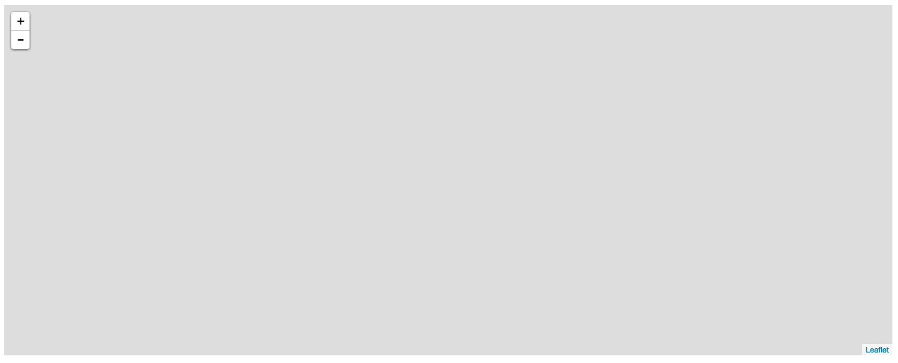
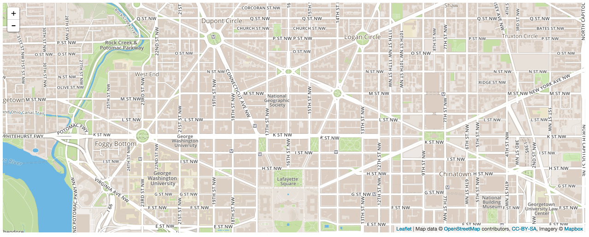
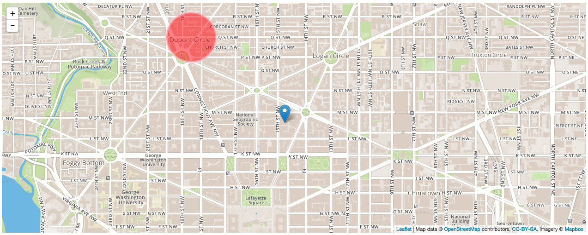
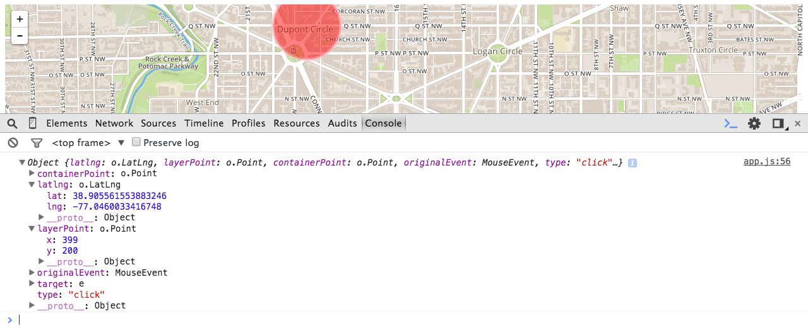
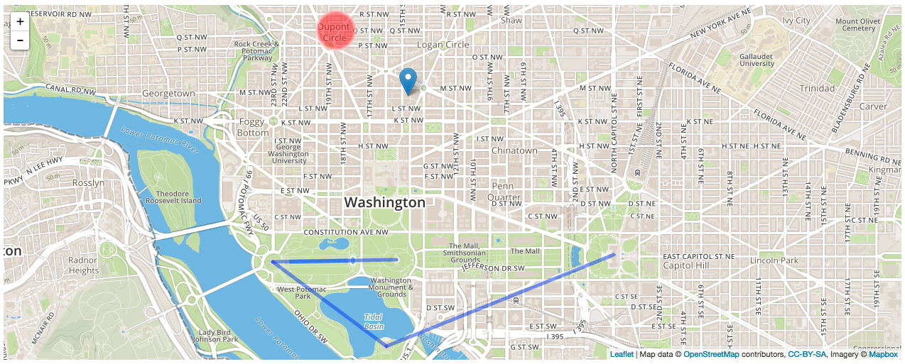

## To-Do
* Exercise: Use markers, circles and polygons to replicate data set?

## Leaflet and Map APIs
* Examine the value of mapping in modern-day web development.
* Compare and contrast popular mapping APIs.
* Using the Leaflet JS library...
  * Create a map using
  * Create markers on a map
  * Create popups
  * Handle events on a map
* Explain what geoJSON is and how map apis like leaflet utilize it.

## Why Are We Having A Class on Maps?

Location-based apps have and continue to be the rave.
* Some of you have already incorporated map APIs into your WDI projects.

## A History of Maps Online

* 2006: Google Maps
* 2006: Google Maps API

## What is Leaflet?

> [Leaflet](http://leafletjs.com/) is the leading open-source JavaScript library for mobile-friendly interactive maps. Weighing just about 33 KB of JS, it has all the mapping features most developers ever need.

Leaflet is a Javascript library, created by [Mapbox](https://www.mapbox.com/), thats allows us to create an render interactive maps in the browser.
* Pulls map information from [OpenStreetMap](https://www.openstreetmap.org/), an open source map database.
* Allows us create the same type of objects you see in Google Maps (e.g., markers, routes, polygons).
* We can use Javascript events to add interactivity to a Leaflet map.

## Setup

### Create files

Create a `map` directory in your in-class directory. From there...

```
$ touch index.html
$ touch style.css
$ touch app.js
```

### Link to the Leaflet stylesheet

```html
<!-- index.html -->

<head>
  <meta charset="UTF-8">
  <title>Fun with Mapz!</title>

  <!-- Leaflet stylesheet -->
  <link rel="stylesheet" href="http://cdnjs.cloudflare.com/ajax/libs/leaflet/0.7.3/leaflet.css" />

  <!-- Our stylesheet -->
  <link rel="stylesheet" href="style.css" />
</head>
```

### Link to Leaflet script file

```html
<body>
  <!-- Let's also create a container for our map -->
  <div id="map"></div>

  <!-- Leaflet script -->
  <script src="http://cdnjs.cloudflare.com/ajax/libs/leaflet/0.7.3/leaflet.js"></script>

  <!-- Our script -->
  <script src="app.js"></script>
</body>
```

### Add map styling

```css
/* style.css */

#map {
  height: 500px;    /* Let's give our map a height so we can see it. */
}
```

### Sign up for Mapbox / Leaflet

[Sign up for an account at Mapbox](https://www.mapbox.com/)

#### Map ID
After creating an account, click "Projects" towards the right of the navbar. It may look like a folder icon without text.
* On the following screen, click "My First Map".
* Copy the value in the **Map ID** field. You'll need this later.

#### API Access Token
Then, click on your username/avatar in the navbar.
* In the new sub-navbar, click on "Apps."
* Copy the value to the right of **Default Public Token**. You'll also need this later.

## Create a Map

### An Empty Map

```js
// app.js

var map = L.map('map').setView([38.9038829, -77.0360032], 15);
```

`L.map()`
* This method takes the ID of your map container as an argument. In this case, it's simply "map".

`.setView()`
* This method takes two arguments...
  1. An array containing the latitude and longitude coordinates of the center of your map.
  2. The starting zoom level of your map.

When your map declaration is set up, you should see something like this...



### Add Tiling

Our map won't do much good without tiling (i.e., the map itself). We can add tiling using Leaflet's `.tileLayer` method. Enter this below your `L.map().setView()` method.
* Make sure to fill in `id` and `accessToken` with the **Map ID** and **Default Public Token** values you saved earlier.

```js
L.tileLayer('https://api.tiles.mapbox.com/v4/{id}/{z}/{x}/{y}.png?access_token={accessToken}', {
    attribution: 'Map data &copy; <a href="http://openstreetmap.org">OpenStreetMap</a> contributors, <a href="http://creativecommons.org/licenses/by-sa/2.0/">CC-BY-SA</a>, Imagery © <a href="http://mapbox.com">Mapbox</a>',
    maxZoom: 18,

    // Replace the below properties with your `Map ID` and `Default Public Token` values you saved earlier, respectively.
    id: 'your.mapbox.project.id',
    accessToken: 'your.mapbox.public.access.token'
}).addTo(map);
```

You should see something like this...



**BOOM**, we've got a map! Now let's do something with it.

## Map Markers & Shapes

Add a marker to your map using the `L.marker` method.
* Takes an array of latitude and longitude as an argument.
* Append with `.addTo( map )` to render.

```js
// `map` is the variable we originally saved our map to.
var generalAssembly = L.marker( [38.9048542, -77.0339403] ).addTo( map );
```

You can also use a circle to cover a portion of a map using `L.circle()` and `.addTo( map )`. Takes three arguments...
  1. Latitude/longitude array.
  2. Radius.
  3. Object with values for `color`, `fillColor` and `fillOpacity`.

```js
var dupontCircle = L.circle([38.9111048, -77.042613,15], 500, {
    color: 'pink',
    fillColor: 'red',
    fillOpacity: 0.5
}).addTo(map);
```

You should see something like this..



You can also use `L.polygon()` to highlight a particular portion of a map. It takes latitude/longitude arrays as arguments.
* Can you think of some useful applications of this feature?

```js
var washington = L.polygon([
    [38.934347, -77.119758],
    [38.995421, -77.041006],
    [38.892885, -76.909599],
    [38.791605, -77.038860]
]).addTo(map);
```

**[EXERCISE OPPORTUNITY?: Markers, Circles, Polygons]**

## Map Pop-Ups

Say you look up a restaurant on Google Maps. When you click on its marker, you would expect to see some helpful information like address, operating hours, or something.
* Let's create a simple version of that using Leaflet's Pop-Up feature.
* We can call the `.bindPopup()` method on the marker we already made.
* If we want our pop-up to automatically render upon page load, we can append it with `.openPopup()`.

```js
// Our marker
var generalAssembly = L.marker( [38.9048542, -77.0339403] ).addTo( map );

// Create a pop-up.
generalAssembly.bindPopup(
  "<h3>General Assembly DC</h3>
  <p>1133 15th St., NW</p>
  <p>8th Floor</p>
  <p>Washington, DC 20005</p>"
)
```

## Events

Pop-ups are cool, but they're not enough. We want to be able to interact with our map and make use of the information that comes with it. **Enter events!**  
* The great thing about Leaflet events is that we can use the Javascript skills we learned at the start of WDI.

Every event in Leaflet returns an event object that contains information about that event.
* Let's see what we get back after setting up a simple click event listener.

```js
//
map.on( "click", function( event ){
  console.log( event );
})
```

Let's look at that event response in the console. What do you see in there?
* Latitude and longitude.
* **[HIGHLIGHT OTHER USEFUL INFORMATION]**



That event response is ours for the taking. We can do whatever we want with that information.
* Let's try something simple: creating a new pop-up that displays the latitude and longitude of where we clicked.

```js
// Need to define the popup that will appear after a click.
var clickPopup = L.popup();

// Now define when and how `clickPopup` will appear.
map.on( "click", function( event ){
  popup
  .setLatLng( event.latlng )
  .setContent( "Coordinates: " + event.latlng.toString() )
  .openOn( map );
})
```

**[EXERCISE/MINI-LAB OPPORTUNITY: Create list of prompts that use event responses in different ways. Have them work in pairs.]**

Check out Leaflet's [event documentation](http://leafletjs.com/reference.html#events) if you want to learn more.

## GeoJSON

### What is GeoJSON?

> [GeoJSON](http://geojson.org/geojson-spec.html) is a format for encoding a variety of geographic data structures. A GeoJSON object may represent a geometry, a feature, or a collection of features. GeoJSON supports the following geometry types: Point, LineString, Polygon, MultiPoint, MultiLineString, MultiPolygon, and GeometryCollection. Features in GeoJSON contain a geometry object and additional properties, and a feature collection represents a list of features.

GeoJSON is essentially a JSON object that contains a variety of information about a point or area (or a collection of the two) on a map.
* With Leaflet, rather than hardcode information about a marker, circle or polygon into our code, we can import that geographical information using GeoJSON.

### GeoJSON Components

All GeoJSON objects must have a `type` value, which can equal a Geometry type, "Feature" or "FeatureCollection".
* Geometry types
  * `Point`
  * `MultiPoint`
  * `LineString`
  * `MultiLineString`
  * `Polygon`
  * `MultiPolygon`
  * `GeometryCollection`
* Feature
  * What you'll probably use most of the time.
  * Can make use of the above geometry types.
  * More importantly, allows us to add custom properties about our geographical information (e.g., location name, pop-up display content).
* Feature Collection
  * A collection of features. These are stored in a `features` property, which is an array of feature objects.

Below is an example GeoJSON "feature".
* **FYI:** The GeoJSON documentation is a great first place to look if you have any questions about syntax.
* **Also FYI:** GeoJSON coordinates are written in the order of longitude then latitude.
  * Google Maps, for example, lists them in the reverse order, so keep that in mind when pulling coordinates from elsewhere.

```js
// We're saving a GeoJSON object to a variable.
var monumentTrail = {
  "type": "Feature",

  // Can set "properties" to whatever we want.
  "properties": {
    "name": "Monuments Trail",
    "city": "Washington, DC",
    "numStops": 5
  },

  // Set geometry type here.
  "geometry": {
    "type": "MultiLineString",
    "coordinates": [
      [[-77.0352791,38.8894838], [-77.050176,38.8892686]],
      [[-77.050176,38.8892686], [-77.0364707,38.8813726]],
      [[-77.0364707,38.8813726], [-77.0090505,38.8899389]]
    ]
  }
}
```

Then we render the GeoJson...

```js
L.geoJson( monumentTrail ).addTo( map );
```

And we should see something like this...



**[EXERCISE/LAB OPPORTUNITY: Use GeoJSON to generate map components]**
* BONUS: Generate geographical information (e.g., lat/long using a 3rd-party API).
